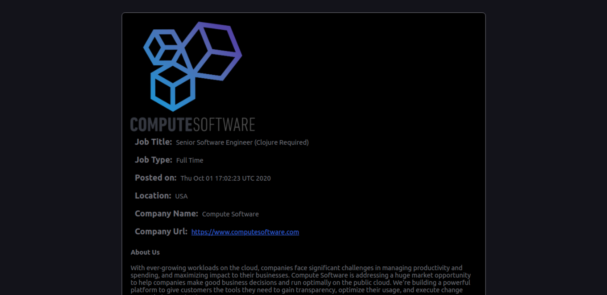

# Job Matchers

A curated catalog of remote entry level jobs best suited for bootcamp students with little to no previous tech-related working experience

## About this project
This is a single page application built with React and Redux. This Application consumes the Github Jobs Api. I use the Fetch Api to get jobs data and i store it in the redux store. The retrieved data can be filtered using a Filter stateless component. It is from the redux store that i then supply the data to various components. 

## Screenshots

## Built With

- React.js
- Redux / Redux-Thunk
- API (Github Jobs)
- Fetch Api
- Netlify
- CSS (Modules)
- HTML
- Webpack
- ES6 JavaScript.

## Live Demo

[Live Demo Link](https://vercel.com/jwillie-26/job-matchers-frontend)

[API Backend link](https://github.com/jwillie-26/Job-Matchers-Api)

## Installation

To get a local copy up and running follow these simple example steps.

### Prerequisites

Have a browser installed

### Setup

Clone this repo with https://github.com/jwillie-26/Job-Matchers-web.git

### Usage - Follow these

1. <code>cd</code> into the project directory
2. run <code>npm install</code>
3. run <code>npm start</code>
3. Navigate to [localhost:3000](http://localhost:3000) in your browser.

## Future Updates
- fetch data from multiple apis
- add pagination
- add more filter types e.g filter by location and job title etc..
- Add login and sign up features so users are able to save jobs
etc..

